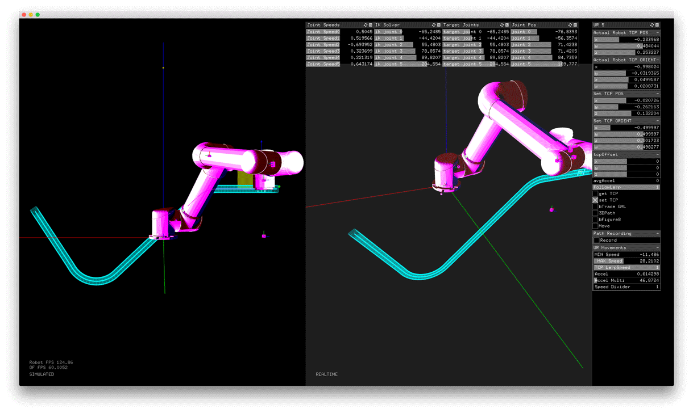
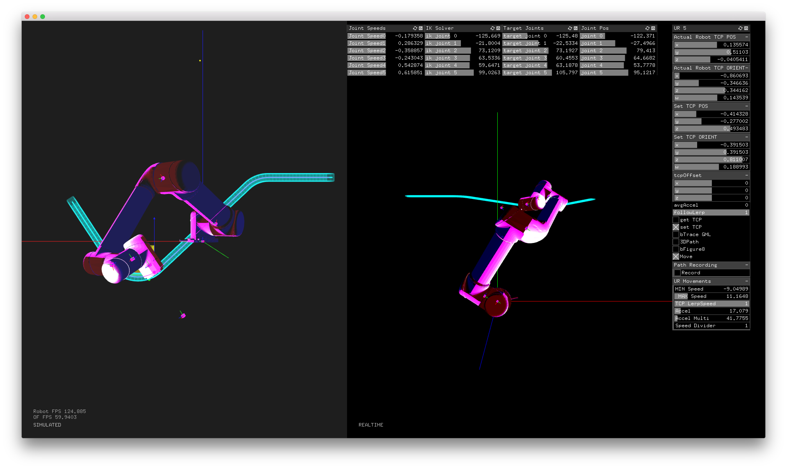

##Follow Path Example

######This example shows you how to move the robot to follow a 2D or 3D Path 

####What You'll Learn
_Follow Path_ goes over:
  *  Import and Create 2D/3D paths
  *  Move & reiorient the robot using a PathController
  *  Dynamically move paths using keypressed
  

##Getting Started
To get started, make sure you've gone through the [Basic Move Example](https://github.com/danzeeeman/robotArmRepo/tree/mad-working/example-basic-move) to get comfortable with open-loop control using _ofxRobotArm_. 

Once you have an IP address for your robot, all you should need to do is modify one line of code in `example-basic-move` to connect to your robot:
   - On `line 40` replace the default ip address with your robot's ip address in `robot.setup()`
   
After that, run the project. You should see your robot positioned properly of the left side of the screen.
Also, you should see that the Robot's FPS is running about 120fps in the lower left hand corner of the GUI. If you don't see a robot in the GUI, or if the Robot's FPS says 0, jump down to the Troubleshooting section.

##Navigating the UI
The UI for _ofxRobotArm_ is laid out in a few sections:
  * The left half holds the _Simulated Robot_
      * You can manaully move and reorient _Simulated Robot_ to update your real robot
  * The right half holds the _Realtime Robot_
      * The _Realtime Robot_ reads and visualizes the joint values streaming from your robot's control box
  * The top right visualizes `target` and `actual` joint values
      * This panel is really helpful for debugging when you're hitting joint limits
  * The vertical panel to the far right holds a lot of important information and settings
      1. Showing the robot's current postion & orientation
      2. Showing the robot's current speed & acceleration
      3. A panel with buttons to `get`, `set`, and `move` the robot's position & orientation
      4. A panel for fine tuning movements: Acceleration Multiplier, Speed Divider, Lerp Factor

##Get Moving
Here's the basic workflow for running `example-follow-path`:

1. Plug in your ethernet connection between your computer and your robot, and make sure you're on the same network :)
2. Run `example-follow-path`. You should see the _Realtime Robot_ on the right of your screen in the same configuration as your actual robot IRL.
3. On the far right panel, press `get TCP` to make the _Simulated Robot_ on the left match the _Realtime Robot_ on the right.

5. With the _Simulated Robot_ moving, press `m` to move your actual robot.
   * If the _Realtime Robot_ isn't moving after you press `m`, check your Acceleration Multiplier and Speed Divider: if the Acceleration Multiplier is too low, or the Speed Divider is too high, the robot will move _verrrrrry_ slowly.
6. Press `m` again to stop sending move commands to the robot.

####Other Usage Notes
We rely on hotkeys for triggering a lot of the UI functionality. Below are the hotkeys we use that work across all the example projects included in ofxRobotArm.

KeyPressed commands for controlling the robot:
- m: move

KeyPressed commands for controlling gizmo:
- r: rotate
- g: translate
- s: scale

KeyPressed commands for viewport navigation:
- 1: Top View
- 2: Front View
- 3: Side View
- 4: Perspective View

