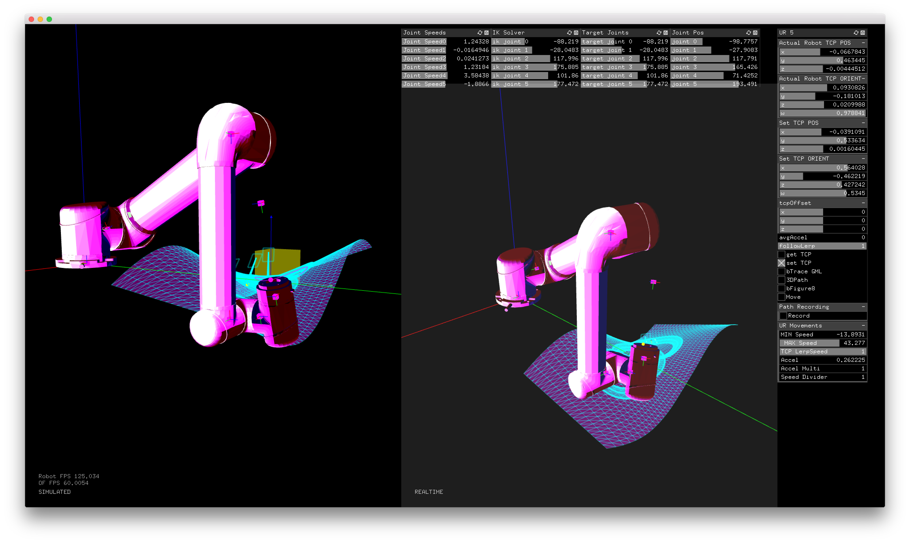

##Follow Path on Surface Example

######This example shows you how to move the robot to follow a Path that's projected on a 3D surface.

####What You'll Learn
_Follow Surface_ goes over:
  *  Import a 3D worksurface
  *  Project 2D paths onto the 3D surface
  *  Move & reiorient the robot to stay normal to the paths on the surface
  *  Retract & approach the surface using offsets
  *  Dynamically move the worksurface & paths using a vector or transformation matrix
  

Make sure you've gone through the [Basic Move Example](https://github.com/danzeeeman/robotArmRepo/tree/master/example-basic-move) to get comfortable with open-loop control using _ofxRobotArm_. 

####Other Usage Notes
We rely on hotkeys for triggering a lot of the UI functionality. Below are the hotkeys we use that work across all the example projects included in ofxRobotArm.

KeyPressed commands for controlling the robot:
- m: move

KeyPressed commands for controlling gizmo:
- r: rotate
- g: translate
- s: scale

KeyPressed commands for viewport navigation:
- 1: Top View
- 2: Front View
- 3: Side View
- 4: Perspective View

