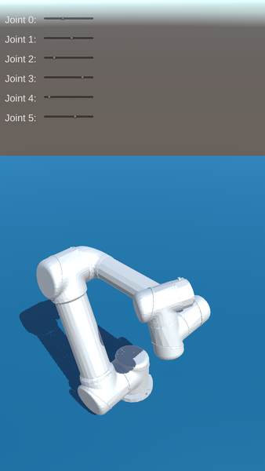

UR5 for Unity
===
Author: [Long Qian](http://longqian.me/aboutme), [Shuyang Chen](https://www.linkedin.com/in/shuyang-shawn-chen-346ab6109)

Date: 2017-02-16

## Overview
The model of UR5 robot and a controller is available in this package. In the sample scene, the robot status is configurable via sliders on GUI layer, like [RViz](http://wiki.ros.org/rviz).

Results on Editor:

Results on Android:

## TODO
* Fix joint upper and lower limits.

