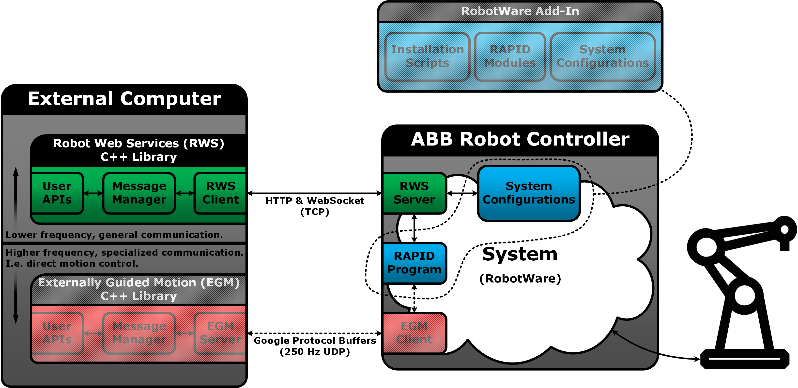

# abb_librws

## Important Notes

RobotWare versions `7.0` and higher are currently incompatible with *abb_librws* (due to RWS `1.0` being replaced by RWS `2.0`). See [this](http://developercenter.robotstudio.com/webservice) for more information about the different RWS versions.

Pull request [abb_librws#69](https://github.com/ros-industrial/abb_librws/pull/69) turned this package from a Catkin package into a plain CMake package. ROS users may use any of the following build tools to build the library:

* ROS 1: `catkin_make_isolated` or [catkin_tools](https://catkin-tools.readthedocs.io/en/latest/index.html).
* ROS 2: [colcon](https://colcon.readthedocs.io/en/released/).

## Overview

A C++ library for interfacing with ABB robot controllers supporting *Robot Web Services* (RWS) `1.0`. See the online [documentation](http://developercenter.robotstudio.com/webservice/api_reference) for a detailed description of what RWS `1.0` is and how to use it.

* See [abb_libegm](https://github.com/ros-industrial/abb_libegm) for a companion library that interfaces with *Externally Guided Motion* (EGM).
* See StateMachine Add-In ([1.0](https://robotapps.robotstudio.com/#/viewApp/7fa7065f-457f-47ce-98d7-c04882e703ee) or [1.1](https://robotapps.robotstudio.com/#/viewApp/c163de01-792e-4892-a290-37dbe050b6e1)) for an optional *RobotWare Add-In* that can be useful when configuring an ABB robot controller for use with this library.

Please note that this package has not been productized, it is provided "as-is" and only limited support can be expected.

### Sketch

The following is a conceptual sketch of how this RWS library can be viewed, in relation to an ABB robot controller as well as the EGM companion library mentioned above. The optional *StateMachine Add-In* is related to the robot controller's RAPID program and system configuration.

### Requirements

* RobotWare version `6.0` or higher (less than `7.0`, which uses RWS `2.0`).

### Dependencies

* [POCO C++ Libraries](https://pocoproject.org) (`>= 1.4.3` due to WebSocket support)

### Limitations

RWS provides access to several services and resources in the robot controller, and this library currently support the following:

* Reading/writing of IO-signals.
* Reading/writing of RAPID data.
* Reading of RAPID data properties.
* Starting/stopping/resetting the RAPID program.
* Subscriptions (i.e. receiving notifications when resources are updated).
* Uploading/downloading/removing files.
* Checking controller state (e.g. motors on/off, auto/manual mode and RAPID execution running/stopped).
* Reading the joint/Cartesian values of a mechanical unit.
* Register as a local/remote user (e.g. for interaction during manual mode).
* Turning the motors on/off.
* Reading of current RobotWare version and available tasks in the robot system.

### Recommendations

* This library has been verified to work with RobotWare `6.08.00.01`. Other versions are expected to work, but this cannot be guaranteed at the moment.
* It is a good idea to perform RobotStudio simulations before working with a real robot.
* It is prudent to familiarize oneself with general safety regulations (e.g. described in ABB manuals).
* Consider cyber security aspects, before connecting robot controllers to networks.

## Usage Hints

This is a generic library, which can be used together with any RAPID program and system configuration. The library's primary classes are:

* [POCOClient](include/abb_librws/rws_poco_client.h): Sets up and manages HTTP and WebSocket communication and is unaware of the RWS protocol.
* [RWSClient](include/abb_librws/rws_client.h): Inherits from `POCOClient` and provides interaction methods for using the RWS services and resources.
* [RWSInterface](include/abb_librws/rws_interface.h): Encapsulates an `RWSClient` instance and provides more user-friendly methods for using the RWS services and resources.
* [RWSStateMachineInterface](include/abb_librws/rws_state_machine_interface.h): Inherits from `RWSInterface` and has been designed to interact with the aforementioned *StateMachine Add-In*. The interface knows about the custom RAPID variables and routines, as well as system configurations, loaded by the RobotWare Add-In.

The optional *StateMachine Add-In* for RobotWare can be used in combination with any of the classes above, but it works especially well with the `RWSStateMachineInterface` class.

### StateMachine Add-In [Optional]

The purpose of the RobotWare Add-In is to *ease the setup* of ABB robot controllers. It is made for both *real controllers* and *virtual controllers* (simulated in RobotStudio). If the Add-In is selected during a RobotWare system installation, then the Add-In will load several RAPID modules and system configurations based on the system specifications (e.g. number of robots and present options).

The RAPID modules and configurations constitute a customizable, but ready to run, RAPID program which contains a state machine implementation. Each motion task in the robot system receives its own state machine instance, and the intention is to use this in combination with external systems that require interaction with the robot(s). The following is a conceptual sketch of the RAPID program's execution flow.

  

To install the Add-In:

1. Go to the *Add-Ins* tab in RobotStudio.
2. Search for *StateMachine Add-In* in the *RobotApps* window.
3. Select the desired Add-In version and retrieve it by pressing the *Add* button.
4. Verify that the Add-In was added to the list *Installed Packages*.
5. The Add-In should appear as an option during the installation of a RobotWare system.

See the Add-In's user manual ([1.0](https://robotapps.blob.core.windows.net/appreferences/docs/27e5bd15-b5ec-401d-986a-30c9d2934e97UserManual.pdf) or [1.1](https://robotapps.blob.core.windows.net/appreferences/docs/cd504500-80e2-4cb6-9419-c60ea4ad6d56UserManual.pdf)) for more details, as well as for install instructions for RobotWare systems. The manual can also be accessed by right-clicking on the Add-In in the *Installed Packages* list and selecting *Documentation*.

## Acknowledgements

The **core development** has been supported by the European Union's Horizon 2020 project [SYMBIO-TIC](http://www.symbio-tic.eu/).
The SYMBIO-TIC project has received funding from the European Union's Horizon 2020 research and innovation programme under grant agreement no. 637107.

The **open-source process** has been supported by the European Union's Horizon 2020 project [ROSIN](http://rosin-project.eu/).
The ROSIN project has received funding from the European Union's Horizon 2020 research and innovation programme under grant agreement no. 732287.

The opinions expressed reflects only the author's view and reflects in no way the European Commission's opinions.
The European Commission is not responsible for any use that may be made of the contained information.

### Special Thanks

Special thanks to [gavanderhoorn](https://github.com/gavanderhoorn) for guidance with open-source practices and ROS-Industrial conventions.
